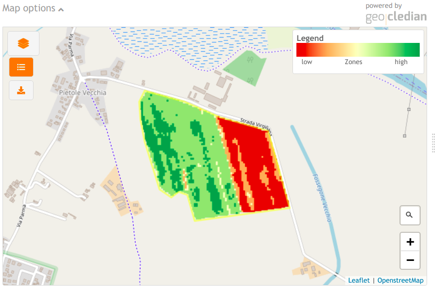

# gc-zones-map widget
## Description
gc-zones-map is an embeddable JavaScript/HTML widget for visualizing the outputs of the ag|knowledge REST API from [geocledian](https://www.geocledian.com).
It is built as a reusable [Vue.js](https://www.vuejs.org) component which allows the integration in [Vue.js](https://www.vuejs.org) applications smoothly. 
You may but you don't have to build the rest of the container application with [Vue.js](https://www.vuejs.org).

## Purpose
With this widget you are able to visualize a the zones product of a registered parcel in a map from the REST API of ag|knowledge.
> **Please note** that the widget contains a DEMO API Key and a DEMO parcel. If you want to visualize your data it has to be registered first in the REST API of ag|knowledge from geocledian.com. <br> Contact us for getting an API Key and registering your data.

It is customizeable via HTML attributes.<br>


## Configuration
This widget is customizeable via HTML attributes and supports the setting of the following attributes.

### Basic options
- gc-apikey: API Key from geocledian, e.g. "39553fb7-7f6f-4945-9b84-a4c8745bdbec"; default: '39553fb7-7f6f-4945-9b84-a4c8745bdbec'
- gc-host: base host, e.g. "geocledian.com"; default: 'geocledian.com'
- gc-basemap: background (basemap) to use in the map, e.g. "osm", "google" or "arcgis"; default: "osm"
- gc-startdate: date as simple ISO date string to set the startdate of an aggregate API product, e.g. '2020-03-01' or "$root.startdate"; default: ""
- gc-enddate: date as simple ISO date string to set the enddate of an aggregate API product, e.g. '2020-10-01' or "$root.enddate"; default: ""
- gc-pixelsize: pixel size for the resulting raster product e.g. 10 in meters, default: 10
- gc-language: initial locale language for translation, e.g. "en" for english; default: "en"
  
### UI options
- gc-available-products: limit the available products, e.g. "zones"; default: "zones"
- gc-available-options: limit the available options, e.g. "" for not title at all; default: "optionsTitle,colorMap,imageBrightness,imageTransparency"
- gc-available-tools: limit the available map tools, e.g. "" for no buttons at all; default: "edit,delete,query,legend,downloadImage,productSelector"
- gc-options-collapsed: start the widget with options collapsed; default: "true"

### Advanced options
#### Proxy mode / URL options
- gc-proxy: string which defines an alternative URL for sending the requests made by the widget instead of gc-host, e.g. "someproxy.someserver.com/app"; default: undefined

> __Note__: in proxy mode both gc-host and gc-api-key attributes are ignored and will not be sent to the given gc-proxy URL! It is assumed, that the Proxy will add the key parameter to the URL and sends the modified URL to the agknowledge service.

- gc-api-base-url: string for changing the base API URL for the agknowledge service; default: "/agknow/api/v3"
- gc-api-secure: boolean for specifying if HTTPS or HTTP shall be used sending the requests made by the widget;  default: true

#### Other
- gc-filter-string: filter string which may be defined externally; e.g. "&crop=bla"; default: ""
- gc-offset: offset in request which may be defined externally; e.g. 1000; default: 0
- gc-limit: limit of total parcels per request which may be defined externally; e.g. 100; default: 250
- gc-parcels: array of parcel objects; may be passed externally or loaded by the widget itself; default: []
- gc-current-parcel-id: used to start with a certain parcel; may be set externally; default: -1
- gc-initial-loading: loads the parcels within this map component itself; if set to false the widget waits for gc-parcels to be set; default: "true"
- gc-drawcontrol-position: position of the draw control in the map; 'bottomleft' or 'verticalcenterright' or 'verticalcenterleft'; default: "bottomleft"
- gc-legend-position: position of the legend in the map; 'topright' or 'bottomleft' ; default: "topright"

>Note: As there are defaults you will only have to set an attribute to change the default internal value.

## Integration
For the integration of the widget you'll have to follow two steps.

You have to add some dependencies in the head tag of the container website.

```html
<html>
  <head>

  <!--GC map component begin -->

  <!-- loads also dependent css files via @import -->
  <link href="css/gc-zones-map.css" rel="stylesheet">
  <!-- init script for components -->
  <script type="text/javascript" src="js/gc-zones-map-init.js"></script>
  
  <!--GC map component end -->

  </head>

```

Then you may create the widget(s) with custom HTML tags anywhere in the body section of the website. Make sure to use a unique identifier for each map component (mapid). 

>If you want to change the id of the parent div ("gc-app") you'll have to change this divs' id also in the init script `gc-zones-map-init.js`, method `initComponent()`.


```html
<div id="gc-app">
  <gc-zones-map mapid="map1"
          gc-apikey="39553fb7-7f6f-4945-9b84-a4c8745bdbec" 
          gc-host="geocledian.com" 
          basemap="osm"
          parcel-id="4483">
  </gc-zones-map>
  <gc-zones-map mapid="map2"
          gc-apikey="39553fb7-7f6f-4945-9b84-a4c8745bdbec" 
          gc-host="geocledian.com" 
          basemap="google"
          parcel-id="4486">
  </gc-zones-map>
</div>
```

> If you want to change the basemap to Google Maps or ESRI ArcGIS Online World Imagery Service please check their terms of use and legal issues first! <br> While ESRI does not restrict the use of ArcGIS Online World Imagery Service technically, there are [legal restrictions](https://www.esri.com/en-us/legal/terms/full-master-agreement).<p> **Please consult the terms of use first. geocledian is not responsible for illegal use of third party services!** <p> For using Google's basemap you'll have to uncomment the URL to Google Maps API and enter your valid Google Maps API key in the init script `gc-zones-map-init.js` (YOUR_VALID_API_KEY_FROM_GOOGLE). For using ESRI ArcGIS Online World Imagery Service please check the source code of `gc-zones-map.js` for enabling it.

```js
// init dependent javascript libs
const libs = ['https://unpkg.com/vue@2.6.11/dist/vue.min.js',
                'https://unpkg.com/leaflet@1.3.1/dist/leaflet.js',
                'https://cdnjs.cloudflare.com/ajax/libs/leaflet.draw/1.0.2/leaflet.draw.js',
                // Google API Key - uncomment the following two lines and enter your valid API Key here
                // 'https://maps.googleapis.com/maps/api/js?key=YOUR_VALID_API_KEY_FROM_GOOGLE', 
                // 'https://unpkg.com/leaflet.gridlayer.googlemutant@0.11.2/dist/Leaflet.GoogleMutant.js',
                'https://unpkg.com/leaflet-geosearch@3.1.0/dist/bundle.min.js',
                'https://cdnjs.cloudflare.com/ajax/libs/axios/0.19.2/axios.min.js',
            ];
```

## Support
The widget is provided as is and we accept no liability for the source code. In case of bugs or questions please contact us at [us](mailto:info@geocledian.com). We are also happy to receive feedback. Unfortunately we can only offer very limited technical support, especially about integration in third party software.

## Used Libraries
- [Vue.js](https://www.vuejs.org)
- [Vue I18n](https://kazupon.github.io/vue-i18n/)
- [Leaflet](https://leafletjs.com/)
- [Leaflet Draw Plugin](http://leaflet.github.io/Leaflet.draw/docs/leaflet-draw-latest.html)
- [Leaflet GeoSearch Plugin](https://github.com/smeijer/leaflet-geosearch)
- [axios](https://github.com/axios/axios)
- [Bulma](https://bulma.io/documentation/)
- [Font awesome](https://fontawesome.com/)

## Legal: Terms of use from third party data providers
- You have to add the copyright information of the used data. At the time of writing the following text has to be visible for [Landsat](https://www.usgs.gov/information-policies-and-instructions/crediting-usgs) and [Sentinel](https://scihub.copernicus.eu/twiki/pub/SciHubWebPortal/TermsConditions/TC_Sentinel_Data_31072014.pdf) data:

```html
 contains Copernicus data 2021.
 U.S. Geological Service Landsat 8 used in compiling this information.
```

- this widget allows using data from the Google Maps API technically. Please ensure the complicance of the [terms of use](https://developers.google.com/maps/terms-20180207#7.-permitted-uses.) first before using them.

- this widget allows the technical integration of ArcGIS Online Services - e.g. as the [World Imagery Service](https://server.arcgisonline.com/ArcGIS/rest/services/World_Imagery/MapServer/). Please ensure the complicance of the [terms of use](https://www.esri.com/en-us/legal/terms/full-master-agreement) first before using them. 

**geocledian is not responsible for illegal use of third party services.**
